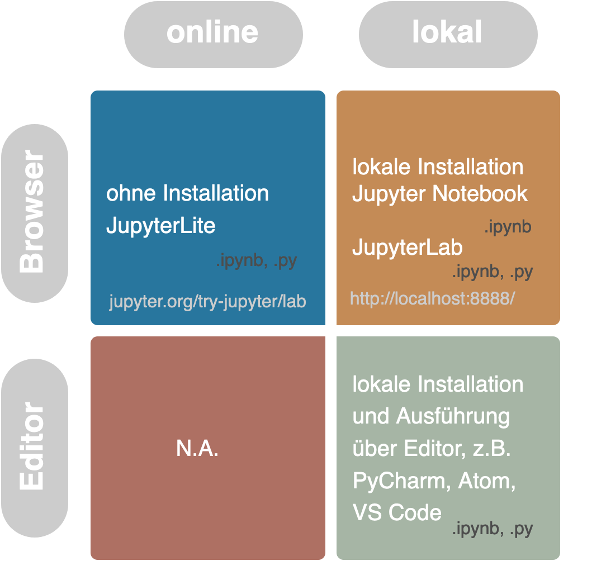

# Python-Code ausführen mit JupyterLite 


:::{figure-md} markdown-fig


Schaubild: Python Code ausführen
:::
<!-- Kommandozeile als zusätzliche Möglichkeit -->

Das Schaubild oben illustriert die gängisten Wege, wie Python-Skripte erstellt und Python-Code ausgeführt werden können: über eine Webseite wie JupyterLite, eine webbasierte Anwendung, die auf einem lokalen Server läuft, wie JupyterLab oder Jupyter Notebook, oder lokal auf dem Rechner über ein Editorprogramm. Die niedrigschwelligste Methode ist JupyterLite, denn hierbei handelt es sich um eine Webseite, die den Einstieg ins Coden ohne vorherigen Installationsaufwand ermöglicht. Zum Einstieg und bis einschließlich zur vierten Sitzung nutzen wir deswegen [JupyterLite](https://jupyter.org/try-jupyter/lab/index.html) und steigen erst in der fünften Sitzung auf eine lokale Installation um: Beim Web Scraping arbeiten wir mit zum Teil sensiblen Daten und sollten schon allein deswegen nicht auf eine Internetseite zurückgreifen. 

<!-- Ein paar Definitionen: -->

- **Jupyter Notebook** ist die Bezeichnung für eine Webanwendung zum Erstellen und Austausch von Jupyter-Notebook-Dokumenten (Dateiendung .ipynb), und für diese Dokumente selbst. Jupyter Notebooks bestehen aus einer Liste von ausführbaren Codezellen und dem jeweiligen Output sowie Textzellen, in die Text zum Erläutern des Codes oder Projekts geschrieben werden kann. 
- **JupyterLab** ist der Nachfolger von der Webanwendung Jupyter Notebook. Es ist eine webbasierte interaktive Entwicklungsumgebung für Jupyter Notebooks, reguläre Pythonskripte (.py) und Daten.
- **JupyterLite** ist eine online JupyterLab-Distribution, die vollständig im Browser läuft. [Hier](https://jupyter.org/try-jupyter/lab/index.html) gehts zu JupyterLite.

```{note}
Die Begriffe **Webanwendung** und **webbasiert** suggerieren einen Zusammenhang zum World Wide Web. Damit kein Missverständnis aufkommt, hier eine kurze Definition zum Begriff Webanwendung: "Anders als ihr Name vielleicht suggerieren mag, muss eine Webanwendung nämlich keinesfalls über das World Wide Web erreichbar sein. [...] Entscheidend dafür, dass sich eine Anwendung als Webanwendung bezeichnen lässt, ist stattdessen einzig der Einsatz von Webtechnologien" (Rohr 2018).
```

```{note}
Wenn Code über einen **lokalen Server** läuft, bedeutet das, dass der Computer mit sich selbst kommuniziert statt mit einem "entfernten", d. h. einem **remote Server**. Wenn  Entwicklungsumgebungen bzw. Anwendungen wie JupyterLab und Jupyter Notebook auf einem lokalen Server laufen, dann heißt das, dass sie zwar genau wie JupyterLite über den Browser geöffnet werden, aber dass sie nicht ans Internet angebunden sind.
```
<!-- oder: dabei nicht über das Internet aufgerufen werden -->

Quellen:

```{bibliography}
   :list: enumerated
   :filter: keywords % "jupyter" or keywords % "webanwendungen"
```

