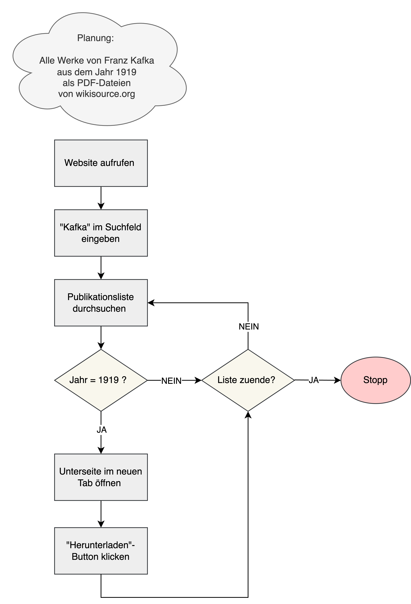

# Grundbegriffe


|Begriff|Englische Entsprechung|Definition (im Python-Kontext)|
|----|----|----|
|Objekt|Object|Grundsätzlich alles: Listen, Vektoren, Funktionen,... Alle Objekte haben einen Datentyp (kurz "Typ"), der bestimmt, welche Eigenschaften das Objekt hat und was man damit machen kann.|
|Anweisung|Statement|Syntaktische Einheit, die Aktionen beschreibt, die von einem Computer ausgeführt werden können. Wenn die Anweisung ausgeführt wird, wird die Aktion veranlasst und der Zustand des Speichers wird geändert.|
|Zuweisung|Assignment|Besondere Art von Anweisung, bei der ein Wert einer Variable zugewiesen wird: Das heißt, dass ein Name festgelegt wird, der für diesen Wert und für einen Speicherplatz steht. Ganz korrekt ausgedrückt würde man sagen, dass ein Objekt oder Wert an einen Namen "gebunden" wird; dieser Name ist sowas wie eine Referenz zu diesem Wert.|
|Ausdruck|Expression|Syntaktische Einheit, die zu einem Wert evaluiert (ausgewertet) werden kann. Ein Ausdruck ist immer Teil einer Anweisung. Ausdrücke stehen auf der rechten Seite von Zuweisungen: x = Ausdruck. Ausdrücke haben immer einen Typ, der dem Datentyp des Werts entspricht, zu dem sie evaluiert werden, z.B. 3 == 4 ist ein Ausdruck vom Typ boolean. Solche Ausdrücke nennt man auch Bedingungen (-> nächste Stunde!).|
|Aussage|Proposition|In der Aussagenlogik ein sprachliches Gebilde, von dem es sinnvoll ist zu sagen, dass es entweder wahr oder falsch ist (Aristoteles). Im Python-Kontext ein Ausdruck, der entweder zu True oder zu False evaluiert werden kann.|
|Auswerten|Evaluate|Der Computer liest einen Ausdruck und wertet diesen aus: Er berechnet etwas und liefert einen Wert.|
|Ausführen|Execute|Der Computer liest eine Anweisung und führt diese aus: Er macht etwas und ändert den Zustand des Speichers.|
|Ausgeben|Output/Print|Das Ergebnis einer Berechnung oder die Ausgabe einer Funktion wird auf dem Bildschirm angezeigt.|
|Programm|Program|Abfolge von Anweisungen|


In der letzten Woche haben wir besprochen, worum es beim Web Scraping eigentlich geht: Darum, Strategien zu entwickeln, wie wir an bestimmte Daten (Metadaten, Volltexte, ...) in einer bestimmten Form (Plain Text, PDF, ...) kommen, und diese in die Logik der Programmiersprache Python zu übertragen.  Wenn wir manuell Daten aus dem Internet herunterladen, würden wir wahrscheinlich in etwa so vorgehen: 

:::{figure-md} markdown-fig


Flussdiagramm
:::

Bei diesen Schritten handelt es sich im Grunde um ein Rezept mit dem Ziel "Textdateien zu Franz Kafkas Werken von 1919 herunterladen", das aus verschiedenen Schritten besteht. Zwischen den einzelnen Schritten treffen wir Entscheidungen, zum Beispiel, dass wir eine Unterseite öffnen, wenn wir in der Publikationsliste ein Werk mit dem Publikationsjahr 1919 finden. Andere Entscheidungen treffen wir dagegen schon, bevor wir überhaupt die Website öffnen, zum Beispiel, dass wir nur Texte aus dem Jahr 1919 suchen. 

Das Beispiel lässt sich auf das Programmieren übertragen: Programme können in Python "**imperativ**" geschrieben werden, also als genau so eine Abfolge von Schritten, die wir dann **Anweisungen** nennen. Die Entscheidungen und Wiederholungen von bestimmten Schritten nennen wir **Verzweigungen** und **Schleifen**, und wir verwenden den Begriff **Kontrollstrukturen** als Überbegriff für solche Konstrukte, weil sie den Programmablauf "kontrollieren". 

In den einzelnen Schritten unseres Rezepts haben wir mit verschiedenen **Objekten** zu tun: Zum Beispiel mit dem Wort "Kafka", das wir in das Suchfeld eingeben, und mit der Zahl 1919, nach der wir die Publikationsliste durchsuchen. Für uns macht es dabei keinen Unterschied, ob wir nach einer Zahl oder einem Wort suchen. Wenn wir aber wollen, dass der Computer für uns die Werke von Kafka herunterlädt, dann macht es einen großen Unterschied, was für ein Objekt durch eine Anweisung bearbeitet werden soll. Objekte unterscheiden sich in Python durch ihre **Eigenschaften** und durch die **Operationen**, die auf sie angewendet werden können - also dadurch, was mit ihnen gemacht werden kann. Im realen Leben könnte man zum Beispiel Lampen dadurch definieren, dass sie eine Eigenschaft "watt" haben, und dass man ein Objekt vom Typ "Lampe" ausschalten und einschalten kann. Eine ganz bestimmte Lampe hat dann zum Beispiel den Wert 20 für die Eigenschaft "watt": 

````{div} full-width
```{image} lampe_klasse.png
:alt: Klasse Lampe
:class: bg-transparent
:width: 35%
```

```{image} lampe.png
:alt: Objekt vom Typ Lampe
:class: bg-transparent
:width: 35%
```
````
<br></br>
Beim Programmieren haben wir es natürlich nicht mit realen Gegenständen, sondern eigentlich mit Datenobjekten zu tun. In Python sind die ganz grundlegenden Typen von Datenobjekten, und die Operationen, die darauf angewendet werden können, vordefiniert, so zum Beispiel Zeichenketten (Text, Wörter) und Zahlen, oder auch Listen. Es gibt daneben aber auch Objekte, für die Nutzer:innen selbst Eigenschaften und definiert und anderen Nutzer:innen bereitgestellt haben. Dazu kommen wir in der Sitzung zu Paketen und Bibliotheken. Alle Objekte in Python haben also einen bestimmten **Datentyp**, oder kurz "Typ", der vorgibt, welche Eigenschaften diese Objekte haben und welche Operationen darauf angewendet werden können. 


Quellen:

```{bibliography}
   :list: enumerated
   :filter: keywords % "computation" or keywords % "mit_01" or keywords % "mit_02"
```


